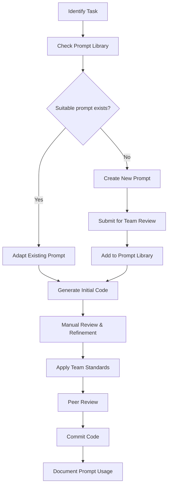

# Team Collaboration with AI for Flutter Development

## Introduction to Team AI Collaboration for Flutter

Ensuring consistent, high-quality output when multiple team members use AI tools like Cursor requires deliberate coordination. This guide presents strategies for standardizing AI usage across your Flutter development team to maintain code consistency, quality, and project velocity.

## Setting Up Team AI Standards

### 1. Create a Team AI Prompt Library

Establish a shared repository of effective prompts for common Flutter development tasks:

```
└── ai-prompts/
    ├── widgets/
    │   ├── form-elements.md
    │   ├── custom-animations.md
    │   └── responsive-layouts.md
    ├── state-management/
    │   ├── provider-patterns.md
    │   ├── bloc-implementation.md
    │   └── riverpod-usage.md
    ├── testing/
    │   ├── widget-tests.md
    │   ├── integration-tests.md
    │   └── mocking-strategies.md
    └── README.md
```

Each prompt file should include:
- Base prompt template
- Variables to be customized
- Example usage
- Expected output structure

### 2. Define Flutter Architecture Prompts

Create standardized prompts that align with your team's architectural decisions:

```markdown
# State Management Implementation Prompt

## Provider Pattern
```
Create a [feature name] using Provider state management with:
- A [FeatureName]Provider class extending ChangeNotifier
- Proper state immutability with copyWith methods
- UI that observes the provider using Consumer widgets
- Action methods for [list required actions]
Follow our team pattern with separate model, provider, and UI files.
```

## BLoC Pattern
```
Implement [feature name] using our standard BLoC pattern with:
- Events: [list required events]
- States: [list possible states]
- Business logic in the BLoC class
- UI that consumes state via BlocBuilder/BlocListener
Structure according to our feature-first architecture.
```
```

### 3. Establish AI Output Standards Document

Create a comprehensive document that defines quality standards for AI-generated code:

```markdown
# AI Output Quality Standards for Flutter

## Widget Standards
- All StatelessWidgets must be const-constructable where possible
- Widgets must include proper documentation comments
- UI components should follow our design system naming conventions
- Complex widgets must be broken down into smaller components

## State Management Standards
- Provider implementations must follow immutable state pattern
- State classes must implement copyWith, equals, and hashCode
- Action methods must be properly named: `handleX`, `onX`, etc.
- Side effects must be properly isolated in dedicated methods

## Testing Requirements
- AI-generated widgets must include associated test files
- Test coverage must address all interaction scenarios
- Mock dependencies must use our standard mocking approach
...
```

## Team Workflow Integration

### 1. AI Review Checklist

Implement a Flutter-specific checklist for reviewing AI-generated code:

```markdown
# AI Code Review Checklist

## Code Structure
- [ ] Widget hierarchy follows team standards
- [ ] State management implementation matches project pattern
- [ ] File organization aligns with project architecture

## Flutter Best Practices
- [ ] Const constructors used where appropriate
- [ ] Keys provided for dynamic list items
- [ ] No performance anti-patterns (e.g., unnecessary rebuilds)
- [ ] Proper separation of UI and business logic

## Team Conventions
- [ ] Naming follows team conventions (e.g., `MyWidgetState` not `_MyWidgetState`)
- [ ] Comments and documentation match team style
- [ ] Proper handling of localization
- [ ] Error handling follows team patterns
```

### 2. AI Integration Workflow

Establish a clear process for integrating AI into the development workflow:



### 3. AI Usage Tracking

Implement a system to track AI usage and effectiveness:

```markdown
# AI Usage Log

## Feature: User Authentication Screen
- **Developer:** Alex Chen
- **Date:** 2023-05-15
- **Prompt Used:** auth/login-form.md
- **Modifications Required:**
  - Adjusted layout for tablet responsiveness
  - Enhanced error handling
  - Added biometric authentication option
- **Time Saved:** Approximately 2 hours
- **Lessons Learned:** Prompt needed more specific styling instructions
```

## Communication Protocols

### 1. AI-Generated Code Labeling

Establish conventions for labeling AI-assisted code:

```dart
// AI-ASSISTED: Initial implementation generated with Cursor AI
// Prompt: widgets/custom-appbar.md
// Developer: Jamie Smith
// Date: 2023-05-20
class CustomAppBar extends StatelessWidget implements PreferredSizeWidget {
  // ...
}
```

### 2. AI Collaboration Channels

Create dedicated communication channels for sharing AI insights:

- **#ai-prompt-sharing**: Channel for sharing effective prompts
- **#ai-troubleshooting**: Help with problematic AI responses
- **#ai-techniques**: General discussion about improving AI workflows

### 3. AI Review Comments

Standardize how AI-related feedback is communicated in code reviews:

```
[AI-CONSISTENCY] This widget structure differs from our standard pattern. 
Please regenerate using the team's form-components.md prompt.

[AI-OPTIMIZATION] The AI generated excessive nesting. Consider requesting 
widget extraction for readability.

[AI-QUALITY] The state management implementation doesn't match our team standards.
Please refer to state-management/provider-patterns.md for the correct approach.
```

## Training and Onboarding

### 1. AI Onboarding for New Team Members

Create a structured onboarding process for new Flutter developers:

```markdown
# AI Onboarding Checklist

## Day 1
- [ ] Introduction to team AI standards document
- [ ] Setup Cursor AI with team configuration
- [ ] Tour of prompt library and usage guidelines

## Week 1
- [ ] Complete "AI for Flutter" training module
- [ ] Practice using team standard prompts with mentor review
- [ ] Contribute first AI-assisted feature with close supervision

## Month 1
- [ ] Review and provide feedback on prompt library
- [ ] Create new prompt with team review
- [ ] Document lessons learned and effectiveness
```

### 2. AI Proficiency Levels

Define Flutter-specific AI skill progression to guide growth:

```markdown
# AI Proficiency Levels for Flutter Development

## Level 1: Basic Application
- Can use existing prompts to generate simple widgets
- Understands how to review and modify AI-generated code
- Identifies when AI is appropriate for a task

## Level 2: Advanced Application
- Creates effective custom prompts for complex widgets
- Effectively guides AI through multi-step implementations
- Can implement state management patterns via AI assistance

## Level 3: Expert Utilization
- Develops reusable prompt templates for team use
- Trains junior developers on effective AI collaboration
- Integrates AI into complex architectural patterns
- Contributes improvements to team AI standards
```

## Quality Assurance for AI-Generated Flutter Code

### 1. Automated Quality Checks

Implement CI/CD checks specific to AI-generated code:

```yaml
# AI Code Quality GitHub Action
name: AI Code Quality

on:
  pull_request:
    paths:
      - 'lib/**'

jobs:
  ai-quality-check:
    runs-on: ubuntu-latest
    steps:
      - uses: actions/checkout@v3
      - name: Flutter Analysis
        uses: flutter/flutter-action@v2
        with:
          channel: 'stable'
      - name: AI-specific linting
        run: |
          flutter pub run custom_ai_linter:check
          # Checks for common AI code smells:
          # - Overly nested widget trees
          # - State management anti-patterns
          # - Missing widget extractions
          # - Inconsistent naming conventions
```

### 2. AI Code Review Guidelines

Create explicit guidance for reviewing AI-generated Flutter code:

```markdown
# AI Code Review Guide for Flutter

## Architecture Review
- Verify that AI-generated widgets fit within the app's architecture
- Check that state management follows team patterns
- Ensure feature organization matches project structure

## Flutter-Specific Checks
- Look for performance optimizations (const, keys, builders)
- Verify widget composition and reuse patterns
- Check responsiveness and adaptive layouts
- Validate error handling and edge cases

## Common AI Issues to Watch For
- Overly complex widget trees (symptom of poor prompt design)
- Inconsistent state management approaches
- Boilerplate code that doesn't match team patterns
- Missing null safety considerations
- Incomplete error handling scenarios
```

### 3. Regular AI Alignment Sessions

Schedule regular team meetings focused on AI alignment:

```markdown
# Bi-Weekly AI Alignment Meeting Agenda

1. Share effective new prompts (10 min)
2. Review common AI issues encountered (15 min)
3. Flutter-specific AI technique demonstrations (20 min)
4. Update team standards document if needed (10 min)
5. Set goals for AI process improvements (5 min)
```

## Standardizing Flutter-Specific AI Usage

### 1. Widget Style Guide Enforcement

Create a Cursor AI configuration that enforces your team's widget styling conventions:

```json
{
  "flutter": {
    "widgetStyles": {
      "enforceConstConstructors": true,
      "preferCompositionOverInheritance": true,
      "maxWidgetNestingLevel": 5,
      "extractMethodThreshold": 15,
      "namingConventions": {
        "widgets": "PascalCase",
        "methods": "camelCase",
        "privateMembers": "_camelCase"
      }
    }
  }
}
```

### 2. Flutter-Specific AI Templates

Create shared template files for common Flutter patterns:

```markdown
# Screen Implementation Template

```
Generate a Flutter screen for [feature name] that:

1. Follows our app's standard screen layout:
   - AppBar with [specific requirements]
   - Body content with [specific layout]
   - Bottom navigation or actions [if applicable]

2. Implements state management using our standard [Provider/Bloc/etc.] pattern:
   - State class with [specific properties]
   - Actions for [list required user interactions]
   - Loading, error, and success states

3. Follows our design system:
   - Use our AppTheme for colors and text styles
   - Apply standard spacing (EdgeInsets.all(16))
   - Use our standard components: AppButton, AppCard, etc.

Ensure the code includes proper documentation comments and follows our file structure conventions.
```
```

### 3. AI Governance Committee

Establish a rotating committee responsible for:

- Reviewing and approving additions to the prompt library
- Updating team standards as Flutter evolves
- Addressing AI usage concerns
- Training team members on effective AI collaboration

## Measuring AI Collaboration Effectiveness

### 1. Flutter-Specific AI Metrics

Track metrics to gauge AI effectiveness for Flutter development:

```markdown
# AI Effectiveness Metrics

## Productivity Metrics
- Time saved per Flutter component
- Reduction in boilerplate code
- Sprint velocity improvement

## Quality Metrics
- Static analysis issues in AI vs. manually written code
- Bug rate in AI-generated components
- Technical debt introduced

## Consistency Metrics
- Adherence to team patterns
- Widget style consistency
- Documentation completeness
```

### 2. Regular AI Retrospectives

Schedule dedicated AI retrospectives to improve team collaboration:

```markdown
# Monthly AI Retrospective Template

## Successes
- What AI-assisted implementations went well?
- Which prompts proved most effective?
- What time savings did we achieve?

## Challenges
- What Flutter-specific issues arose with AI assistance?
- Where did output require significant reworking?
- What types of tasks proved difficult for AI?

## Learning Opportunities
- What new Flutter AI techniques did team members discover?
- How can we improve our prompt library?
- What additional training would be beneficial?

## Action Items
- Updates needed for team standards
- New prompt templates to develop
- Training sessions to schedule
```

## Conclusion

Effective team collaboration with AI for Flutter development requires standardization, clear processes, and continuous improvement. By establishing shared prompt libraries, quality standards, and review processes, teams can maintain consistency while maximizing the benefits of AI assistance.

Remember that AI tools should enhance your Flutter development process, not dictate it. Regular evaluation and adjustment of your AI collaboration strategies will ensure they continue to serve your team's specific needs and workflow.
