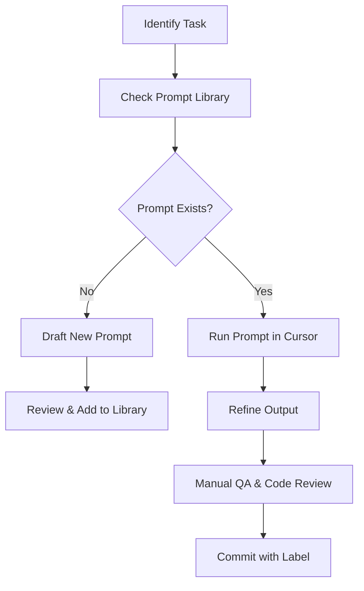

# Team Collaboration with AI for Nest.js Development

## Introduction

Working with AI tools like Cursor across a backend team requires defined practices to maintain consistency, quality, and security. This guide establishes shared processes, tools, and collaboration strategies for teams building with Nest.js.

## Standardizing Team AI Usage

### 1. Prompt Library Structure

Organize reusable prompts in a shared repo:

```
ai-prompts/
├── auth/
│   ├── login-flow.md
│   ├── jwt-guard.md
├── modules/
│   ├── user-crud.md
│   ├── blog-posts.md
├── decorators/
│   ├── roles-guard.md
├── logging/
│   └── request-logger.md
```

### 2. Enforce Project-Wide Output Standards

```markdown
# Nest.js AI Output Standards

- TypeScript required for all modules
- DTOs must include `class-validator` decorators
- Controller routes follow REST naming
- Services must isolate business logic
- Include appropriate exceptions (e.g., NotFoundException)
- Return shapes are documented and consistent
```

### 3. Code Labeling

```ts
// AI-GENERATED: Generated using ai-prompts/modules/user-crud.md
// Author: Rachel Lee
// Date: 2024-04-21
```

## AI Workflow



## AI Review Checklist

```markdown
- [ ] Is the generated code TypeScript compliant?
- [ ] Are all routes documented and correct?
- [ ] DTOs include validation decorators?
- [ ] Are exceptions handled properly?
- [ ] Does the service follow SOLID principles?
```

## Onboarding Plan

```markdown
# Nest.js AI Onboarding

## Day 1
- Setup Cursor
- Overview of .cursor config

## Week 1
- Use standard prompts
- Generate a new module and service

## Month 1
- Submit custom prompt
- Join bi-weekly AI review
```

## Metrics to Track

- Time saved per feature
- Rework rate of AI code
- Prompt reuse frequency
- Team prompt contributions

## Retrospectives

Hold monthly AI sessions:
- New prompt demos
- Prompt refactoring discussions
- Buggy output analysis
