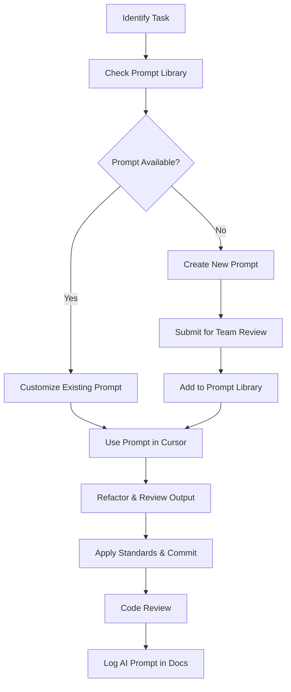

# Team Collaboration with AI for Next.js Development

## Introduction to Team AI Collaboration for Next.js

Leveraging AI tools like Cursor in a team environment can greatly accelerate Next.js development—but without clear standards and workflows, it can also introduce inconsistencies. This guide outlines a structured approach for ensuring alignment, quality, and collaboration across your team when using AI to build modern web applications with Next.js.

## Setting Up Team AI Standards

### 1. Create a Team AI Prompt Library

Establish a centralized, version-controlled repository of effective prompts tailored to your Next.js stack:

```
└── ai-prompts/
    ├── pages/
    │   ├── marketing-pages.md
    │   ├── dashboard-pages.md
    │   └── error-pages.md
    ├── components/
    │   ├── layout-components.md
    │   ├── interactive-widgets.md
    │   └── next-image-usage.md
    ├── data-fetching/
    │   ├── server-components.md
    │   ├── getStaticProps-ssg.md
    │   └── swr-usage.md
    ├── api-routes/
    │   ├── user-auth.md
    │   └── admin-endpoints.md
    └── README.md
```

Each prompt file should contain:
- A reusable base prompt with variables
- Context-specific instructions (App vs. Pages Router)
- Output formatting and typing expectations
- Performance or SEO requirements if applicable

### 2. Define Next.js Architecture Prompts

Standardize prompts to align with your application’s architectural patterns:

#### Server Component Prompt
```
Create a Next.js Server Component for [feature/page] using the App Router. 
Include server-side data fetching with cache revalidation set to 3600s.
The component should:
- Fetch from [API endpoint]
- Include metadata export
- Use `notFound()` for invalid states
- Follow our project layout with responsive utility classes (Tailwind)
```

#### API Route Prompt
```
Generate a Next.js route handler at `app/api/[route]/route.ts` that:
- Supports [GET/POST/etc.] method(s)
- Validates input with Zod
- Returns structured JSON
- Uses NextResponse for handling errors
- Follows our error conventions and HTTP status codes
```

### 3. Establish AI Output Quality Standards

```markdown
# AI Output Standards for Next.js

## Page/Component Standards
- Server components by default; explicitly use `use client` when needed
- TypeScript required for all interfaces and props
- Next.js Image usage instead of native  tags
- Layouts and pages must export metadata

## API Route Standards
- Use NextRequest/NextResponse types
- Include detailed error responses
- Follow project-level API response schema

## Performance & SEO
- Lazy load heavy components where possible
- Always include metadata in exported pages
- Minimize client-side JS in Server Components
```

## Team Workflow Integration

### 1. AI Review Checklist

```markdown
# AI Code Review Checklist (Next.js)

## Structure & Typing
- [ ] Correct routing structure (App vs Pages Router)
- [ ] TypeScript types are accurate and complete
- [ ] Server/Client component split is intentional

## Next.js Best Practices
- [ ] Uses `next/image` with correct sizing
- [ ] Proper metadata and SEO tags are included
- [ ] Data fetching includes caching and error states

## Team Conventions
- [ ] Folder/file structure follows team layout
- [ ] Code is clean, readable, and maintainable
- [ ] Prompt reference comment is included
```

### 2. AI Workflow for Developers



### 3. Tracking AI Usage & Effectiveness

```markdown
# AI Usage Log

## Feature: User Settings Page
- **Developer:** Priya Patel
- **Prompt Used:** pages/dashboard-pages.md
- **Date:** 2024-04-21
- **Outcome:**
  - Saved ~2.5 hours
  - Needed manual fixes in layout responsiveness
  - Prompt updated for better error boundaries
- **Lesson Learned:** Add visual loading state pattern in prompt template
```

## Communication Protocols

### 1. Labeling AI-Generated Code

```tsx
// AI-GENERATED: Generated with Cursor using ai-prompts/pages/dashboard-pages.md
// Author: Harsh S.
// Date: 2024-04-21
```

### 2. Dedicated AI Collaboration Channels

- `#nextjs-ai-prompts`: For sharing new and effective prompts
- `#ai-code-review`: For peer reviews of AI-generated code
- `#cursor-tips`: For sharing usage tips, issues, or settings

### 3. AI Review Comments

```
[AI-STANDARD] This does not follow our App Router metadata conventions. Please reference `pages/seo-pages.md`.

[AI-PERF] Consider lazy-loading this gallery component. Prompt can be adjusted with "load on scroll".

[AI-CONSISTENCY] Use next/image instead of . Cursor prompt may need updating.
```

## AI Onboarding and Growth

### 1. New Developer Onboarding Plan

```markdown
# AI Onboarding Checklist for Next.js Developers

## Day 1
- [ ] Overview of AI usage policy and benefits
- [ ] Setup Cursor with .cursor config
- [ ] Clone and explore ai-prompts/ repo

## Week 1
- [ ] Complete Cursor tutorial with Next.js
- [ ] Use existing prompt to build first page
- [ ] Submit first AI-assisted PR

## Month 1
- [ ] Propose and refine one new prompt
- [ ] Participate in biweekly AI alignment
```

### 2. AI Proficiency Levels

```markdown
# AI Skill Tiers for Next.js

## Level 1: Prompt Follower
- Can run and modify existing prompts
- Knows when to use Server vs Client components

## Level 2: Prompt Crafter
- Creates new prompts from scratch
- Knows App Router intricacies, SEO practices, caching

## Level 3: AI Leader
- Coaches team on AI usage
- Maintains ai-prompts repo and Cursor configs
- Measures and improves prompt success over time
```

## Measuring Collaboration Success

### Key Metrics to Track:
- Time saved per AI task
- Ratio of accepted vs reworked AI output
- Prompt reuse across projects
- Bug rate of AI vs manually written code
- Number of shared prompts added weekly

## Regular AI Alignment Sessions

```markdown
# Biweekly AI Sync Agenda

1. Share new high-performing prompts (10 min)
2. Discuss AI bugs or inconsistencies (15 min)
3. Live demo of AI usage for advanced patterns (20 min)
4. Update standards or prompt templates (10 min)
5. Assign prompt review or creation tasks (5 min)
```

## Conclusion

When AI is used as a collaborative tool in Next.js projects—backed by well-defined standards, shared prompt libraries, and regular team alignment—it can transform your velocity, quality, and consistency.

The key is to treat AI like a junior developer: guide it, review its work, and help it improve with each iteration. The better your collaboration strategy, the more valuable AI becomes in your team’s Next.js development workflow.
