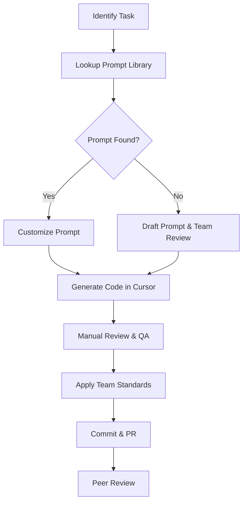

# Team Collaboration with AI for Node.js Development

## Introduction

Using AI tools in team-based Node.js projects can boost productivity but requires clear guidelines to keep code consistent, secure, and maintainable. This document outlines best practices for collaboration.

## 1. Building a Shared Prompt Library

Organize prompts by feature in a version-controlled repo:
```
ai-prompts/
├── api/
│   ├── users-crud.md
│   ├── auth-flow.md
├── services/
│   ├── email-service.md
│   ├── payment-service.md
├── middleware/
│   └── error-handler.md
├── tests/
│   └── user-tests.md
```

## 2. Defining AI Output Standards

```markdown
# Node.js AI Output Standards

- Use consistent code formatting (ESLint + Prettier)
- Include JSDoc comments for functions and classes
- Error handling with proper HTTP status codes
- Break code into modules (routes, controllers, services)
- Security checks: input validation and auth middleware
```

## 3. Labeling AI-Generated Code

```js
// AI-GENERATED: Using ai-prompts/services/payment-service.md
// Author: Dev Team
// Date: 2025-04-21
```

## 4. Collaboration Workflow



## 5. AI Review Checklist

```markdown
- [ ] Does code follow project folder structure?
- [ ] Are modules and functions well-named?
- [ ] Is error handling implemented correctly?
- [ ] Are security and validation in place?
- [ ] Are JSDoc comments present?
```

## 6. Communication Channels

- **#nodejs-ai-prompts**: Share and discuss new prompts
- **#ai-code-review**: Review AI-generated pull requests
- **#cursor-nodejs**: Cursor configuration and tips

## 7. Onboarding New Team Members

```markdown
# Node.js AI Onboarding

## Day 1
- Install Node.js and project dependencies
- Setup Cursor AI and .cursor config

## Week 1
- Generate simple CRUD API using prompts
- Submit first AI-assisted PR

## Month 1
- Propose and document a new prompt
- Participate in AI best-practice workshop
```

## 8. Metrics and Retrospectives

- Track time saved per feature
- Count prompts reused and updated
- Measure bug rate in AI vs manual code
- Hold monthly sessions to refine prompts and standards
