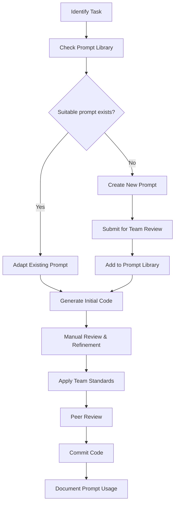

# Team Collaboration with AI for React Native Development

## Introduction to Team AI Collaboration for React Native

To ensure consistency, quality, and development velocity in React Native projects, teams using AI tools like Cursor must align around standardized practices. This document proposes a structured framework for integrating AI collaboration into team workflows, promoting reusable knowledge, scalable development, and reliable outcomes.
## Foundation: Standardizing AI Use Across the Team

### 1. Create a Team AI Prompt Library

Establish a shared, organized prompt library to avoid duplication and accelerate development:

```
└── ai-prompts/
    ├── components/
    │   ├── ui-elements.md
    │   ├── animations.md
    │   └── responsive-layouts.md
    ├── state-management/
    │   ├── redux-patterns.md
    │   ├── context-api-implementation.md
    │   └── mobx-usage.md
    ├── testing/
    │   ├── component-tests.md
    │   ├── e2e-tests.md
    │   └── mocking-strategies.md
    └── README.md
```

Each prompt file should include:
- Base prompt template
- Variables to be customized
- Example usage
- Expected output structure

### 2. Define React Native Architecture Prompts

Create standardized prompts that align with your team's architectural decisions:

```markdown
# State Management Implementation Prompt

## Redux Pattern

Create a [feature name] using Redux with:
- Action types defined as constants
- Action creators for [list required actions]
- A reducer with proper state immutability
- Selectors for accessing state
- UI components connected via useSelector/useDispatch
Follow our team pattern with separate actions, reducers, and selectors files.

## Context API Pattern

Implement [feature name] using React Context API with:
- A dedicated context provider component
- Custom hook for accessing context
- State management with useReducer
- Actions for [list required actions] Structure according to our feature-first architecture.
```
### 3. Establish AI Output Standards Document

Create a comprehensive document that defines quality standards for AI-generated code:

```markdown
# AI Output Quality Standards for React Native

## Component Standards
- Use functional components with React Hooks (no class components).
- Components must be strongly typed using TypeScript interfaces or types.
- UI components should follow our design system naming conventions
- Complex components must be broken down into smaller components
- Implement memoization (React.memo, useMemo, useCallback) for performance-sensitive components.
- Use getItemLayout where applicable.
- Use named stylesheets, avoid inline styles.
- Adhere to design system components and naming conventions (e.g., PrimaryButton, FormInput).
- Avoid deep prop drilling—use context or hooks instead.
- Ensure proper loading, empty, and error states.
- Include accessibility features:
- Use accessibilityLabel, accessible, and proper roles.
- Ensure compatibility with screen readers and voiceover.

## State Management Standards
# Redux:
- Use reselect for all selectors.
- Reducers must be pure and immutable.
- Action creators must follow {entity}/{action} naming convention.
- Use createSlice if using Redux Toolkit.

# Context API:
- Provide a typed context value and custom hook (e.g., useAuth).
- Separate state and dispatch into different contexts if needed.

# MobX/Zustand:
Follow store segregation by domain.

- Avoid over-reliance on single global stores.
- Side effects (API calls, logging, async ops) must be:
- Isolated in middleware (redux-saga, redux-thunk, useEffect, or custom async hooks).
- Explicit and well-documented.

All stores or contexts must be tested in isolation.

## Testing Requirements
- Every AI-generated file must include a corresponding *.test.tsx or *.spec.ts test.
- Ensure coverage of key interactions (e.g., button clicks, input typing).
- Mock data should follow our fixture patterns
- Use React Testing Library or Detox (for E2E) with realistic user flows.

# Include:
- Tests for loading, success, and error states.
- Boundary and edge case handling (e.g., null, empty values).

# Mocks and fixtures should:
- Follow existing __mocks__ or fixtures/ directory structures.
- Be reusable across test files.

```

## Team Workflow Integration

### 1. AI Review Checklist

Implement a React Native-specific checklist for reviewing AI-generated code:

```markdown
# AI Code Review Checklist

## Code Structure
- [ ] Component structure follows team standards
- [ ] State management implementation matches project pattern
- [ ] File organization aligns with project architecture
- [ ] Code avoids deeply nested structures; logic is broken into helper functions or hooks
- [ ] Props are well-typed and validated using TypeScript interfaces or PropTypes (if applicable)

## React Native Best Practices
- [ ] No inline styles
- [ ] FlatList components use optimized rendering
- [ ] Proper keyboard handling for form inputs
- [ ] Platform-specific code is properly isolated
- [ ] Safe area insets are handled using react-native-safe-area-context
- [ ] Navigation logic uses correct pattern (e.g., stack, tab, modal navigation)
- [ ] Avoids usage of deprecated or unstable APIs

## Team Conventions
- [ ] Naming follows team conventions
- [ ] Comments and documentation match team style
- [ ] Proper handling of internationalization
- [ ] Error handling follows team patterns
- [ ] All string literals and error messages are externalized or localized
- [ ] Feature flags or environment-specific logic are handled using team-approved methods

```

### 2. AI Integration Workflow

Establish a clear process for integrating AI into the development workflow:



### 3. AI Usage Tracking

Implement a system to track AI usage and effectiveness:

```markdown
# AI Usage Log

## Feature: Product List Screen
- **Developer:** Sarah Johnson
- **Date:** 2023-05-15
- **Prompt Used:** components/lists/product-list.md
- **Modifications Required:**
  - Added pull-to-refresh functionality
  - Enhanced error state handling
  - Fixed image caching issues
- **Time Saved:** Approximately 3 hours
- **Lessons Learned:** Prompt needed more specific platform optimization instructions
```

## Communication Protocols

### 1. AI-Generated Code Labeling

Establish conventions for labeling AI-assisted code:

```jsx
/**
 * AI-ASSISTED: Initial implementation generated with Cursor AI
 * Prompt: components/forms/login-form.md
 * Developer: Alex Chen
 * Date: 2023-05-20
 */
const LoginForm = () => {
  // ...
};
```

### 2. AI Collaboration Channels

Create dedicated communication channels for sharing AI insights:
```
- **#ai-prompt-sharing**: Channel for sharing effective prompts
- **#ai-troubleshooting**: Help with problematic AI responses
- **#ai-techniques**: General discussion about improving AI workflows
```

### 3. AI Review Comments

Standardize how AI-related feedback is communicated in code reviews:

```
[AI-CONSISTENCY] This component structure differs from our standard pattern. 
Please regenerate using the team's component-layout.md prompt.

[AI-OPTIMIZATION] The AI generated code with inline styles. Consider requesting 
a version that uses our StyleSheet patterns.

[AI-QUALITY] The Redux implementation doesn't match our team standards.
Please refer to state-management/redux-patterns.md for the correct approach.
```

## Training and Onboarding

### 1. AI Onboarding for New Team Members

Create a structured onboarding process for new React Native developers:

```markdown
# AI Onboarding Checklist

## Day 1
- [ ] Introduction to team AI standards document
- [ ] Setup Cursor AI with team configuration
- [ ] Tour of prompt library and usage guidelines

## Week 1
- [ ] Complete "AI for React Native" training module
- [ ] Practice using team standard prompts with mentor review
- [ ] Contribute first AI-assisted feature with close supervision

## Month 1
- [ ] Review and provide feedback on prompt library
- [ ] Create new prompt with team review
- [ ] Document lessons learned and effectiveness
```

### 2. AI Proficiency Levels

Define React Native-specific AI skill progression to guide growth:

```markdown
# AI Proficiency Levels for React Native Development

## Level 1: Basic Application
- Can use existing prompts to generate simple components
- Understands how to review and modify AI-generated code
- Identifies when AI is appropriate for a task

## Level 2: Advanced Application
- Creates effective custom prompts for complex components
- Effectively guides AI through multi-step implementations
- Can implement state management patterns via AI assistance

## Level 3: Expert Utilization
- Develops reusable prompt templates for team use
- Trains junior developers on effective AI collaboration
- Integrates AI into complex architectural patterns
- Contributes improvements to team AI standards
```

## Quality Assurance for AI-Generated React Native Code

### 1. Automated Quality Checks

Implement CI/CD checks specific to AI-generated code:

```yaml
# AI Code Quality GitHub Action
name: AI Code Quality

on:
  pull_request:
    paths:
      - 'src/**'

jobs:
  ai-quality-check:
    runs-on: ubuntu-latest
    steps:
      - uses: actions/checkout@v3
      - name: Setup Node.js
        uses: actions/setup-node@v3
        with:
          node-version: '16'
      - name: Install dependencies
        run: npm install
      - name: ESLint with React Native rules
        run: npm run lint
      - name: TypeScript Check
        run: npm run type-check
      - name: AI-specific linting
        run: |
          npx eslint --config .eslintrc.ai.js ./src
          # Checks for common AI code smells:
          # - Inline styles
          # - Anonymous functions in render
          # - Missing memoization
          # - Performance anti-patterns
```

### 2. AI Code Review Guidelines

Create explicit guidance for reviewing AI-generated React Native code:

```markdown
# AI Code Review Guide for React Native

## Architecture Review
- Verify that AI-generated components fit within the app's architecture
- Check that state management follows team patterns
- Ensure feature organization matches project structure

## React Native-Specific Checks
- Look for performance optimizations (memo, useCallback, PureComponent)
- Verify accessibility attributes (accessibilityLabel, etc.)
- Check platform-specific handling (Platform.OS checks)
- Validate responsive layouts for different screen sizes

## Common AI Issues to Watch For
- Overly complex component trees (symptom of poor prompt design)
- Inconsistent state management approaches
- Excessive re-renders due to missing optimization
- Missing error boundaries
- Incomplete platform-specific handling
```

### 3. Regular AI Alignment Sessions

Schedule regular team meetings focused on AI alignment:

```markdown
# Bi-Weekly AI Alignment Meeting Agenda

1. Share effective new prompts (10 min)
2. Review common AI issues encountered (15 min)
3. React Native-specific AI technique demonstrations (20 min)
4. Update team standards document if needed (10 min)
5. Set goals for AI process improvements (5 min)
```

## Standardizing React Native-Specific AI Usage

### 1. Component Style Guide Enforcement

Create a Cursor AI configuration that enforces your team's component styling conventions:

```json
{
  "reactNative": {
    "componentStyles": {
      "preferFunctionalComponents": true,
      "enforceStyleSheet": true,
      "noInlineStyles": true,
      "maxComponentComplexity": 200,
      "extractComponentThreshold": 100,
      "namingConventions": {
        "components": "PascalCase",
        "hooks": "useCamelCase",
        "styles": "camelCase",
        "props": "camelCase"
      }
    }
  }
}
```

### 2. React Native-Specific AI Templates

Create shared template files for common React Native patterns:

```markdown
# Screen Implementation Template

```
Generate a React Native screen for [feature name] that:

1. Follows our app's standard screen layout:
   - SafeAreaView wrapper
   - Header component with [specific requirements]
   - Content container with [specific layout]
   - Bottom action area [if applicable]

2. Implements state management using our standard [Redux/Context/etc.] pattern:
   - State shape with [specific properties]
   - Actions for [list required user interactions]
   - Loading, error, and success states

3. Follows our design system:
   - Import colors and spacing from our theme
   - Use our Typography components for text
   - Apply standard component spacing

4. Handles these platform differences:
   - iOS: [specific behavior]
   - Android: [specific behavior]

Ensure the code is properly typed with TypeScript and follows our file structure conventions.


### 3. AI Governance Committee

Establish a rotating committee responsible for:

- Reviewing and approving additions to the prompt library
- Updating team standards as React Native evolves
- Addressing AI usage concerns
- Training team members on effective AI collaboration

## Measuring AI Collaboration Effectiveness

### 1. React Native-Specific AI Metrics

Track metrics to gauge AI effectiveness for React Native development:

```markdown
# AI Effectiveness Metrics

## Productivity Metrics
- Time saved per component implementation
- Reduction in boilerplate code
- Sprint velocity improvement
- Time to first usable draft of a feature
- Developer feedback cycle time (time from AI output to approval)
- Parallel development throughput (AI-generated stubs enabling concurrent tasks)

## Quality Metrics
- ESLint/TypeScript issues in AI vs. manually written code
- Bug rate in AI-generated components
- Technical debt introduced
- Test coverage of AI-generated code (compared to manual code)
- Post-merge fixes required due to missed edge cases or regressions
- Clarity of logic and separation of concerns in AI-authored modules

## Consistency Metrics
- Adherence to team patterns
- Component style consistency
- Documentation completeness
- Reusability of AI-generated components (measured by reuse across modules)
- Adherence to accessibility standards (a11y)
- Consistency in error handling and edge case treatment
```

### 2. Regular AI Retrospectives

Schedule dedicated AI retrospectives to improve team collaboration:

```markdown
# Monthly AI Retrospective Template

## Successes
- What AI-assisted implementations went well?
- Which prompts proved most effective?
- What time savings did we achieve?

## Challenges
- What React Native-specific issues arose with AI assistance?
- Where did output require significant reworking?
- What types of tasks proved difficult for AI?

## Learning Opportunities
- What new React Native AI techniques did team members discover?
- How can we improve our prompt library?
- What additional training would be beneficial?

## Action Items
- Updates needed for team standards
- New prompt templates to develop
- Training sessions to schedule
```

## Platform-Specific Collaboration Strategies

### 1. iOS-Specific Collaboration

```markdown
# iOS-Specific AI Collaboration Guidelines

- Include iOS simulator version in prompts for version-specific behaviors
- Maintain a catalog of iOS-specific edge cases for common AI tasks
- Document Apple Human Interface Guidelines references for AI prompts
- Track iOS-specific performance metrics in AI-generated components
```

### 2. Android-Specific Collaboration

```markdown
# Android-Specific AI Collaboration Guidelines

- Include Android API level in prompts for version-specific behaviors
- Document Material Design references for AI prompts
- Maintain Android-specific performance benchmarks for AI evaluation
- Track fragmentation issues across Android devices with AI-generated UIs
```

## Cross-Team AI Collaboration

### 1. Working with Design Teams

```markdown
# Design-Development AI Collaboration

- Establish shared vocabulary for design-to-code prompt translation
- Create design token integration prompts for consistent styling
- Document design system component specifications for AI reference
- Build a design review process for AI-generated components
- Define prompt templates for translating Figma elements into code
- Establish rules for spacing, layout, and responsiveness interpretation
- Ensure accessibility guidelines are embedded in AI styling prompts
- Set up a feedback loop between design tools and AI-generated previews
- Maintain a centralized mapping of design patterns to code abstractions
- Use automated visual diffing tools to compare design vs. AI output
```

### 2. Working with Backend Teams

```markdown
# Frontend-Backend AI Collaboration

- Create API integration prompt templates
- Establish data transformation patterns for API responses
- Document error handling conventions for network requests
- Build shared type definitions for API contracts
- Define conventions for loading, success, and error UI states
- Standardize GraphQL/REST query/mutation naming in prompts
- Implement retry and timeout strategies in AI-generated network logic
- Ensure AI-generated code respects backend rate limits and pagination
- Establish logging and monitoring practices for API interactions
- Align validation logic between frontend and backend schemas (e.g., Zod/Yup with backend DTOs)

```

## Conclusion

Effective team collaboration with AI for React Native development requires standardization, clear processes, and continuous improvement. By establishing shared prompt libraries, quality standards, and review processes, teams can maintain consistency while maximizing the benefits of AI assistance.

Remember that AI tools should enhance your React Native development process, not dictate it. Regular evaluation and adjustment of your AI collaboration strategies will ensure they continue to serve your team's specific needs and workflow.
